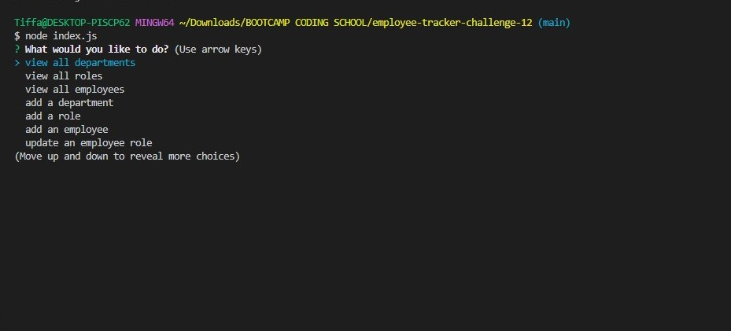

# Employee Tracker

## Description:
- This application allows users to view, add, update employees and delete employees using MySQL, Node.js, and JavaScript.

## Summary:
- Create an Employee Tracker generator using JavaScript, Node.js, Inquirer and MySQL.

## Table of Contents:
* [Description](#description)
* [Summary](#summary)
* [Tools Used](#tools-used)
* [Visuals](#visuals)
* [Installation and Database Setup](#installation-and-database-setup)
* [Usage](#usage)
* [License](#license)
* [Contributing](#contributing)
* [Tests](#tests)
* [Contact Informations](#contact-informations)
* [Demo](#demo)

## Visuals:

## Tools Used:
- JavaScript
- Node.js
- Inquirer
- MySQL

## Installation and Database Setup:
- To use this app npm init has to be called to create your package.json file.
- The following necessary Npm dependencies must be installed to run the application properly: Inquirer, Console.table, Asciiart-logo & MySQL2.
- To properly install the database you must install <b>MySQL</b> on your computer, create an profile in which you have a root and a password.
- In your command line you must type <b>mysql -u root -p</b> and then enter, type your <b>password</b> that you created on MySQL on the following line.
- To finally add the database you must do the following: <b>source db/schema.sql</b> then enter, source db/seeds.sql then enter.
- On connection.js please provide your custom made password created above.

## Usage:
- To be able to use this application,  install the node dependencies shown on package.json and database setup. Run the app in the terminal on VS Code use <b>node index.js</b> OR <b>npm start.</b>

## License:
- For more information on license types: https://opensource.org/

## Contributing:
- N/A

## Tests:
- N/A

## Contact Informations:
* GitHub Username: <a href="https://github.com/TiffyAlva">TiffyAlva</a>
* Email: <a href="malito:TiffanyAlvarez54@gmail.com">TiffanyAlvarez54@gmail.com

## Demo:
- <a href= "https://drive.google.com/file/d/1S1xIp2N9fyFjVM-QXlITTH5aFEQVLDM0/view?usp=sharing">Demostration Video</a>

